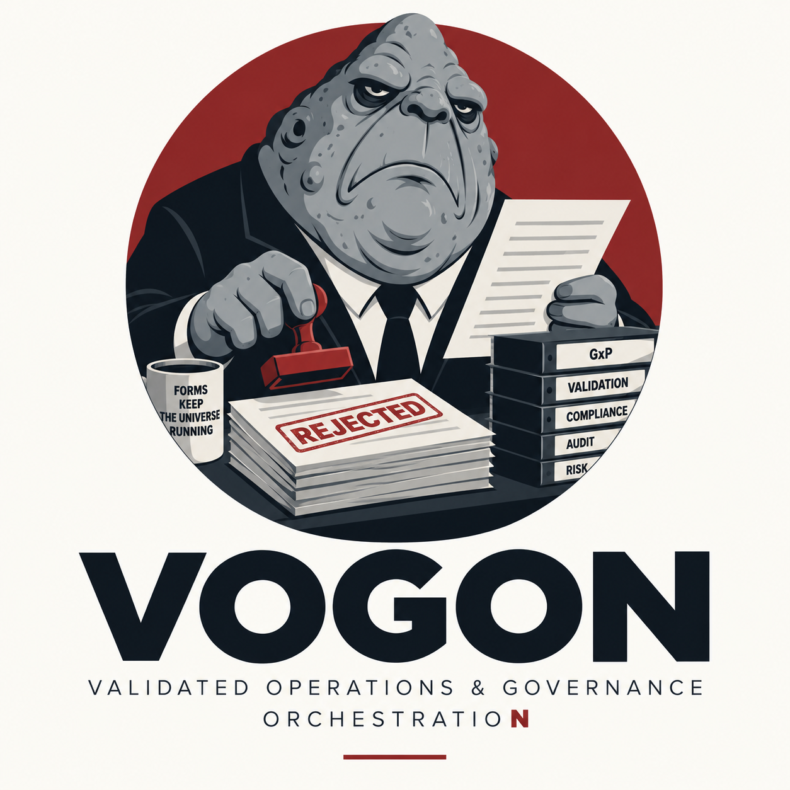

<div align="center">

<picture>
  <source srcset="assets/images/02-vogon-rejected-logo_dark.png" media="(prefers-color-scheme: dark)">
  
</picture>

# VOGON

### Validated Operations & Governance OrchestratioN

**Because software was getting shipped far too easily.**

`COMPLIANCE` · `TRACEABILITY` · `RISK MANAGEMENT` · `A BRIGHTER TOMORROW`

**[ Read the controlled document → ](https://pcingola.github.io/vogon/)**

</div>

---

VOGON is an AI agent that produces and maintains the GxP evidence trail around software development: requirements, risk assessments, traceability, verification evidence, change control, and the validation package an auditor will actually ask for.

**The controlled version of this document is published at [pcingola.github.io/vogon](https://pcingola.github.io/vogon/).** It covers what VOGON does, how the PR gate works, pricing, known side effects, and the issue-submission procedure.

```text
DOCUMENT:  README.md
REF:       VGN-DOC-000  REV 1
STATUS:    SUPERSEDED — uncontrolled copy
REFER TO:  https://pcingola.github.io/vogon/
```

This file is retained for reference only. Printing it does not make it controlled.

---

<div align="center">

**Same problems. More process.**

*Because good enough is not compliant.*

</div>
