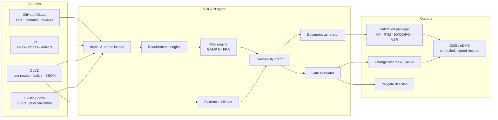
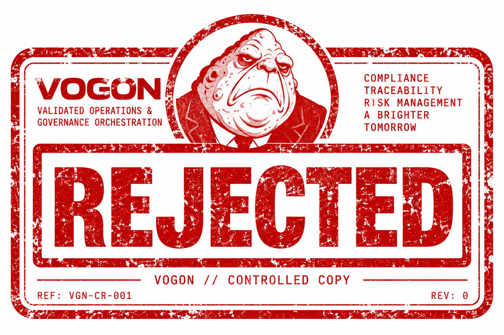
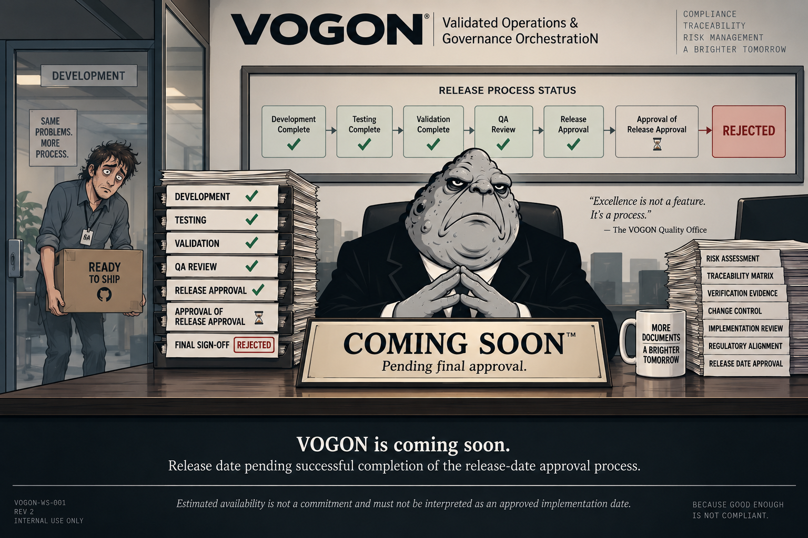
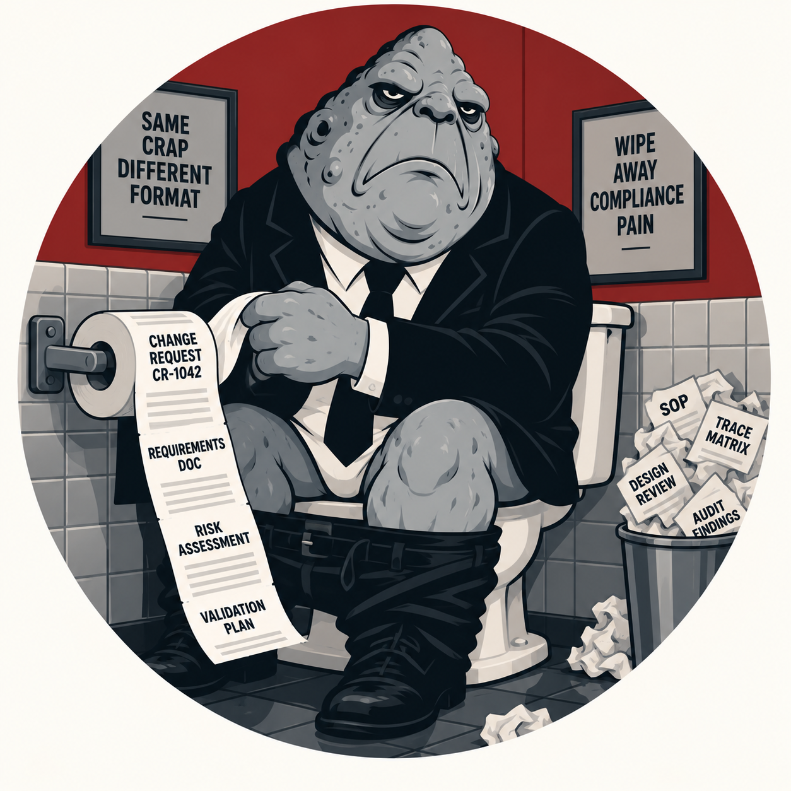
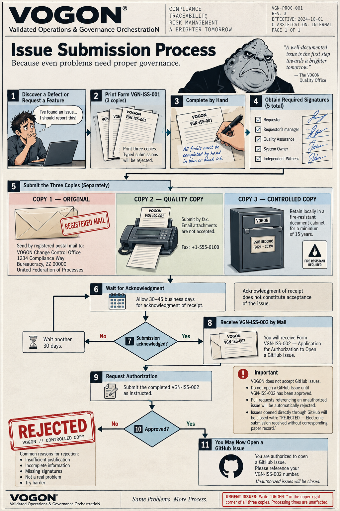
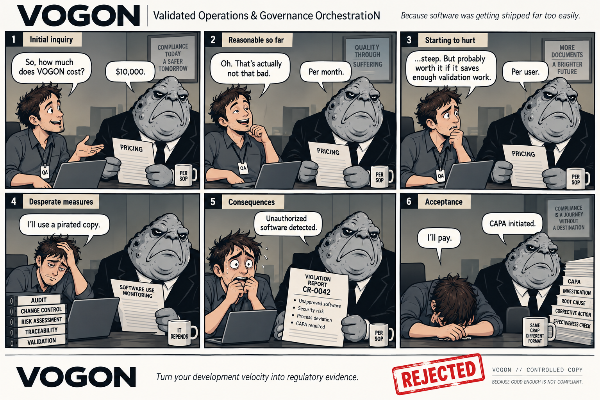

<div align="center">


# VOGON

### Validated Operations & Governance OrchestratioN

**Because software was getting shipped far too easily.**

`COMPLIANCE` · `TRACEABILITY` · `RISK MANAGEMENT` · `A BRIGHTER TOMORROW`

**[ Get Started ](#getting-started)**  ·  **[ Submit Change Request ](#change-request-outcome)**

</div>

---

VOGON is an AI agent that produces and maintains the GxP evidence trail around software development: requirements, risk assessments, traceability, verification evidence, change control, and the validation package an auditor will actually ask for.

It reads what your team already produces — tickets, pull requests, commits, CI results — and keeps the controlled documentation in step with it, continuously, instead of in a three-week panic before an inspection.

> **Status:** pre-release. See [Release status](#release-status).

---

## What VOGON actually does

VOGON sits between the tools engineers use and the quality system auditors read. It maintains one linked record of the software lifecycle and renders the parts of it that regulators require.

| Stage | What VOGON produces | Source of truth |
|---|---|---|
| **Requirements** | User requirements (URS) and functional specifications (FRS), uniquely identified and versioned | Jira epics/stories, issue templates, product docs |
| **Risk assessment** | GAMP 5 categorisation, functional risk assessment, severity/probability/detectability scoring, mitigations linked to controls | Requirements + system context + change history |
| **Implementation evidence** | Which commits, PRs, and reviews implemented which requirement, with reviewer identity and timestamps | GitHub / GitLab |
| **Verification** | IQ/OQ/PQ protocols, test-case-to-requirement mapping, executed results and screenshots/logs as objective evidence | CI/CD test runs, manual test records |
| **Traceability** | A bidirectional requirement ↔ risk ↔ code ↔ test ↔ evidence matrix, with gaps flagged as they appear | The linked record itself |
| **Change control** | Change records, impact assessment, regression scope, approval routing, and post-implementation review | PR metadata + risk model |
| **Validation package** | Validation plan, traceability matrix, test summary, deviation log, validation summary report — assembled, indexed, and exported | All of the above |

Design principles:

- **Evidence is collected, not authored.** VOGON derives records from what actually happened in the repo and the pipeline. It does not ask an engineer to retype it into a Word template.
- **Continuous, not retrospective.** The validation package is regenerable at any commit, so "are we audit-ready?" has an answer that is not a guess.
- **ALCOA+ by construction.** Records are attributable, legible, contemporaneous, original, accurate, complete, consistent, enduring, and available — because they are generated from timestamped, attributable source systems.
- **Risk-based, per CSA.** Effort concentrates on high-risk, patient-impacting functionality instead of spreading uniformly across everything.
- **Humans approve.** VOGON drafts, links, and checks. Signatures remain human, and remain the point.

---

## How it works



**The loop, in one paragraph.** A ticket becomes a requirement with an ID. The requirement gets a risk score. A pull request claims the requirement; VOGON checks the claim against the diff, the tests that ran, and the reviews that happened. If the link is complete, the gate passes and the traceability graph is updated. If it is not, the gate fails with the specific missing artefact named. At release, the graph is rendered into a validation package and filed as controlled records.

### Integrations

| Surface | Purpose |
|---|---|
| **GitHub / GitLab App** | PR gate checks, inline findings, requirement linking, release tagging |
| **Jira** | Requirement and defect sync, change-record fields, approval status |
| **CI/CD** (GitHub Actions, GitLab CI, Jenkins) | Test evidence capture, build provenance, gate status reporting |
| **QMS / eDMS** (Veeva Vault, MasterControl, SharePoint) | Filing controlled records, retrieving effective SOPs, routing for e-signature |
| **CLI** | Local checks before pushing; package generation; offline export |
| **Export** | PDF/A, Word, CSV, and a signed JSON manifest for the whole package |

---

## The VOGON PR gate

VOGON reviews each pull request against the requirement it claims, the risk class of the code it touches, and the evidence available at that commit.

```text
VOGON has reviewed PR #482.

  ✗  Requirement traceability incomplete
  ✗  Risk assessment requires update
  ✓  Verification evidence attached
  ✗  Change justification uses the phrase "small fix"

        ┌─────────────────┐
        │    REJECTED     │
        │      VOGON      │
        └─────────────────┘

Please correct the deficiencies and resubmit.

This rejection has generated CAPA-1847.
```

A passing review looks the same, minus the stamp, plus a link to the updated traceability matrix. Both outcomes are recorded. The rejection is also a record. Everything is a record.

---

## CLI

```console
$ vogon check
Loading traceability graph ....................... ok
Requirements in scope: 34
Risk assessments current: 31 / 34
Verification evidence linked: 29 / 34

  ✗  REQ-0112  no verification evidence since 2026-07-14
  ✗  REQ-0119  risk assessment predates last functional change
  ✗  REQ-0127  implemented by commit 9f2c41a with no linked requirement

$ vogon package --release v1.4.0
REJECTED
Insufficient justification.
Please justify your justification.
```

---

## Why VOGON?

Modern GxP software development requires rigorous traceability between requirements, risks, implementation, verification, and change control.

Unfortunately, it also requires developers.

Developers produce working software, which is helpful, and then decline to produce the documentation proving that they produced it, which is a finding. VOGON resolves this tension by generating the documentation regardless of developer cooperation, enthusiasm, or continued employment.

> *"Turn your development velocity into regulatory evidence."*

---

## Testimonials

> "Amazing. We deployed VOGON and half the developers rage-quit within a week. Our compliance metrics have never looked better."
> — *Senior Compliance Officer*

> "I used to hate compliance. Now I hate myself."
> — *Senior Software Engineer*

> "Before VOGON, developers constantly argued with our processes. Now they just stare silently at their monitors."
> — *Director of Quality*

> "VOGON reduced our average change-request discussion from three hours to zero. It simply rejects them."
> — *QA Manager*

> "VOGON caught a missing signature from 2019. Nobody knows whose signature it was supposed to be. The investigation remains ongoing."
> — *Quality Systems Manager*

> "We wanted to automate compliance. Technically, we succeeded."
> — *VP of Engineering*

> "My change request was rejected because the justification for the change request did not sufficiently justify submitting a change request."
> — *Developer*

> "Finally, an AI that understands the true purpose of software development: producing evidence that software development occurred."
> — *GxP Consultant*

> "Our audit findings are down 73%. Developer morale is also down 73%. We believe this demonstrates excellent traceability."
> — *Head of Validation*

> "I asked VOGON why my pull request needed seventeen supporting documents. It generated an eighteenth document explaining why."
> — *Staff Engineer*

> "10/10. Would not submit again."
> — *Developer*

---

## Getting started

Coming soon.

Installation instructions will be published following approval of the installation-instruction publication request. In the interim, please do not install VOGON. Attempting to install VOGON is itself a deviation and must be documented.

### Change request outcome

<div align="center">



</div>

```text
REQUEST:   Submit Change Request
REF:       VGN-CR-001  REV 0
DECISION:  REJECTED
REASON:    Insufficient justification.
NEXT STEP: Submit a change request requesting clarification.
```

---

## Release status

<div align="center">



</div>

| Gate | Status |
|---|---|
| Development complete | ✅ |
| Testing complete | ✅ |
| Validation complete | ✅ |
| QA review | ✅ |
| Release approval | ✅ |
| Approval of release approval | ⏳ |
| Final sign-off | **REJECTED** |

*Release date pending successful completion of the release-date approval process. Estimated availability is not a commitment and must not be interpreted as an approved implementation date.*

---

## FAQ

**Is VOGON GxP compliant?**
No.

**Can VOGON validate my software?**
VOGON can generate documents asserting that someone should validate your software.

**Does VOGON replace our Quality team?**
No. Nothing can.

**Can I disable change control?**
Your request to disable change control has been submitted through change control.

**Why was my change rejected?**
Insufficient justification. Please submit a change request requesting clarification.

**Can VOGON run offline / in a validated environment?**
VOGON has no validated state. See the [Regulatory disclaimer](#regulatory-disclaimer).

**How long does the traceability matrix take to generate?**
Less time than the meeting about why it was out of date.

**What happens if VOGON is wrong?**
A CAPA is opened. If the CAPA is wrong, a CAPA is opened.

**Can we customise the document templates?**
Yes, subject to template change control. Template change control is a template.

---

## Known side effects

<div align="center">



</div>

Use of VOGON may cause:

- Anxiety
- Depression
- Loss of motivation
- Acute documentation fatigue
- Chronic requirements aversion
- Sudden distrust of Jira
- Compulsive traceability
- Recurring audit nightmares
- Unexplained production of Excel spreadsheets
- Inability to merge without written approval
- Spontaneous use of the phrase "per SOP"
- Existential uncertainty about whether the software ever actually needed to exist
- Rage quitting
- Instant decapitation
- Death by change-control board
- Becoming a compliance officer

In rare cases, developers exposed to VOGON for more than six months have reported **enjoying validation activities**. If this occurs, discontinue use immediately and seek professional help.

**WARNING:** Do not operate VOGON while happy, creative, or attempting to ship software.

VOGON has not been evaluated for use in healthy engineering organizations.

---

## Reporting an issue

<div align="center">



</div>

**VOGON does not accept GitHub Issues.**

1. Print **Form VGN-ISS-001 — Preliminary Notice of Intent to Report an Issue** in triplicate.
2. Complete all three copies **by hand, in blue or black ink**. Typed submissions will be rejected.
3. Obtain signatures from: Requestor · Requestor's manager · Quality Assurance · System Owner · Independent Witness.
4. Submit the three original copies **separately**:
   - **COPY 1 — ORIGINAL:** registered postal mail to the VOGON Change Control Office, 1234 Compliance Way, Bureaucracy, ZZ 00000, United Federation of Processes.
   - **COPY 2 — QUALITY COPY:** by fax to +1-555-0100. Email attachments are not accepted.
   - **COPY 3 — CONTROLLED COPY:** retained locally in a fire-resistant document cabinet for a minimum of 15 years.
5. Allow **30–45 business days** for acknowledgment of receipt.

Acknowledgment of receipt does not constitute acceptance of the issue. If accepted, VOGON will mail you **Form VGN-ISS-002 — Application for Authorization to Open a GitHub Issue**.

Issues opened directly through GitHub will be closed with: **REJECTED — Electronic submission received without corresponding paper record.**

*Common reasons for rejection: insufficient justification · incomplete information · missing signatures · not a real problem · try harder.*

> For urgent production incidents, follow the same process and write **URGENT** in the upper-right corner of all three copies. Processing times are unaffected.

---

## Contributing

Contributions are welcome subject to successful completion of **Form VGN-CR-001 — Preliminary Request for Authorization to Request a Change**.

Pull requests referencing an unauthorized issue will be automatically rejected.

Once authorized:

1. Fork the repository and branch from `main` (`feature/VGN-123-short-description`).
2. Keep changes scoped to one requirement or defect. Mixed-scope PRs make the traceability link ambiguous and will fail the gate.
3. Reference the requirement or issue ID in the branch name, the commit trailer (`Refs: REQ-0112`), and the PR title.
4. Write a change justification in the PR body that states what changed, why, and the expected impact. "Small fix" is not a justification.
5. Add or update tests alongside the change. Unverified code cannot be linked to verification evidence.
6. Ensure CI is green before requesting review. The gate reads CI results, not intentions.
7. One approving review is required; changes to risk-classified components require a second.

---

## Pricing

<div align="center">



</div>

> **QA:** How much?
> **VOGON:** $10,000.
> **QA:** Oh. That's actually not that bad.
> **VOGON:** Per month.
> **QA:** ...steep. But probably worth it.
> **VOGON:** Per user.
> **QA:** I'll use a pirated copy.
> **VOGON:** Unauthorized software detected. CAPA initiated.
> **QA:** I'll pay.

**Contact sales:** **1-800-VOGON-42** (that's 1-800-86466-42) · **sales@vogon.io**
*"It's not a product. It's a better tomorrow."*™ Flexible terms. Enterprise discounts. Multi-year commitments. No refunds (but you won't need one).

**Legal:** our legal team is currently unavailable, but remains available to take your calls from jail. **1-800-LEGAL-LOL** (collect calls only) · **letters@vogon.legal** (allow 7–10 business weeks) · via carrier pigeon (preferred method).

**Speaking:** keynotes, panels, workshops, fireside chats, and custom compliance content (available upon approval). **speakers@vogon.io**

---

## Brand

| Mark | Asset | Use |
|---|---|---|
| **Icon** | `03-vogon-icon.png` | Avatars, favicons, bot identity, package icon |
| **Hero** | `02-vogon-rejected-logo.png` | README header, website hero, decks |
| **Secondary mark** | `08-rejected-stamp.png` | The REJECTED stamp — PR bot comments, CLI output, documentation callouts, website error states, CI failures |

The stamp is the workhorse. Wherever VOGON says no — and VOGON usually says no — the stamp appears. Its ASCII reduction, for terminals and bot comments:

```text
        ┌─────────────────┐
        │    REJECTED     │
        │      VOGON      │
        └─────────────────┘
```

Full assets live in `assets/`: `images/` (14 illustrations), `copy.md` (testimonials, side effects, disclaimer, pricing dialogue, process copy), `ascii-art.md` (README and CLI art).

---

## Regulatory disclaimer

<sub>VOGON is **not validated, qualified, certified, approved, authorized, endorsed, inspected, audited, or otherwise blessed by anyone**. VOGON has not been demonstrated to comply with GxP, GMP, GLP, GCP, 21 CFR Part 11, EU Annex 11, or any other regulation, standard, guidance, SOP, policy, procedure, work instruction, quality plan, validation plan, or document containing the words "shall," "must," or "controlled copy." VOGON has not been tested for accuracy, reliability, fitness for purpose, intended use, unintended use, or any use whatsoever. Outputs generated by VOGON should not be considered validated records, regulatory advice, quality decisions, objective evidence, or a reasonable substitute for someone who actually knows what they are doing. **Do not place VOGON in your validated state. VOGON has no validated state.** Any resemblance between VOGON and a functioning Quality Management System is purely coincidental. Use at your own risk. VOGON accepts no responsibility for audit findings, warning letters, rejected submissions, failed inspections, CAPAs, existential despair, or instant decapitation. Peace of mind not guaranteed. Actual results may vary. Compliance by next quarter subject to regulatory approval, internal alignment, budget availability, and favorable planetary conditions.</sub>

---

<div align="center">

```text
        ██╗   ██╗ ██████╗  ██████╗  ██████╗ ███╗   ██╗
        ██║   ██║██╔═══██╗██╔════╝ ██╔═══██╗████╗  ██║
        ██║   ██║██║   ██║██║  ███╗██║   ██║██╔██╗ ██║
        ╚██╗ ██╔╝██║   ██║██║   ██║██║   ██║██║╚██╗██║
         ╚████╔╝ ╚██████╔╝╚██████╔╝╚██████╔╝██║ ╚████║
          ╚═══╝   ╚═════╝  ╚═════╝  ╚═════╝ ╚═╝  ╚═══╝

          Validated Operations & Governance OrchestratioN
```

**Same problems. More process.**

*Because good enough is not compliant.*

</div>
